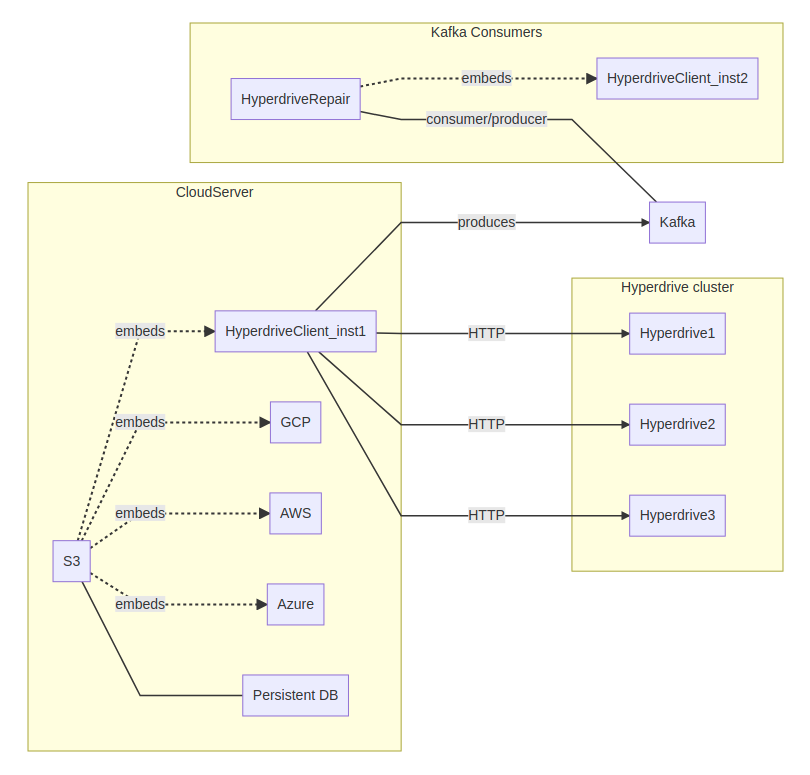
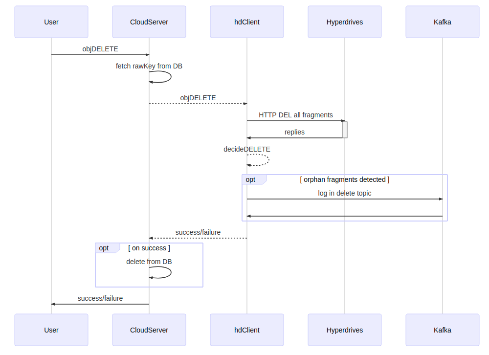
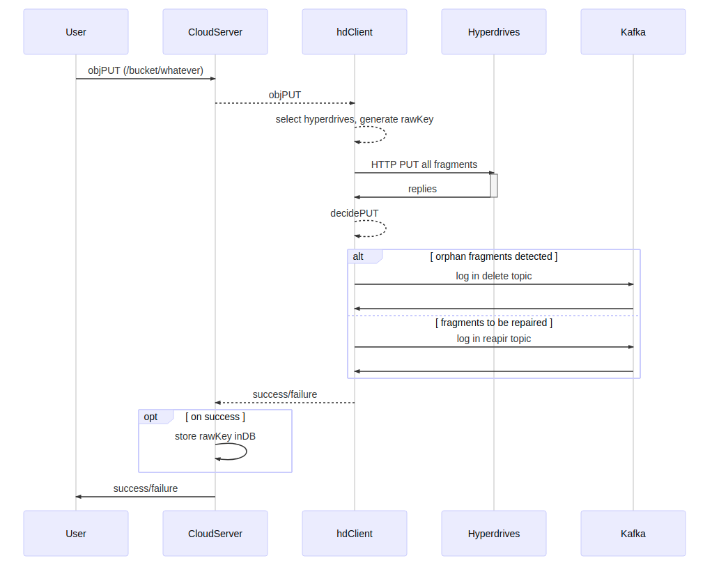
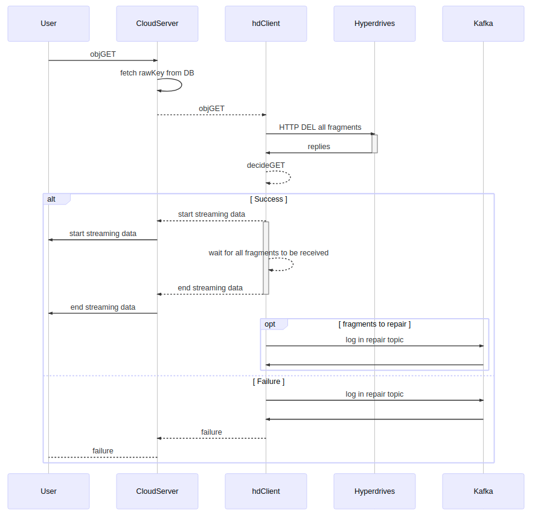

# Design and Architecture choices

The hyperdrive client is a new [CloudServer](https://github.com/scality/cloudserver) data backend, responsible for storing objects inside on-premise hyperdrive servers. It must support several erasure coding capabilities, splitting large objects, select the best available hyperdrives to store data on.

As a data backend it must construct its own metadata in form of a key/string, returned to CloudServer on PUT. This metadata is stored by CloudServer inside its own metadata backend and is provided to the client on GET or DELETE. This document describes the functional requirements and choices. Implementation is described in more details in the other files under docs/ folder.t

All fragments are **IMMUTABLE**. Any mutation is handled at the CloudServer level.

## Glossary

* **hyperdrive**: Scality's own KVS, providing local erasure coding protection over multiple disks
* **object/objectkey**: S3 object name to store/retrieve/delete.
* **chunk**: big objects are split into several chunks. Small objects are made of only a single chunk.
* **fragment**: part of a chunk. For replication, it is a full copy. For erasure coding, it is a data or coding part.
* **CP,n**: replication/copy where n is the final number of fragments written. CP,2 means the original and 1 copy.
* **RS,k,m**: systematic Reed-Solomon erasure code with k data segments and m parities.
* **rawKey/genKey**: metadata created by hdclient to track all fragments of an object, encoded as a string and returned on PUT to CloudServer for persistent storage.

## High-level description



## Key generation scheme

As per CloudServer architecture a data backend is given on GET and DELETE only a data blob (rawKey) generated by the backend itself on PUT and subsequently saved in persistent storage. This section describes the constraints and selected generation scheme. There is two different levels of keys at play here:

 - rawKey: stored by CloudServer as result of a PUT
 - fragment keys: actual keys used to query hyperdrive KVS

#### List of requirements

|Requirement | Description |
| ---------- | ------------|
| Version | A perfect solution often does not exists. And will not stay that way. Generated keys MUST start with a version, so that we can easily change the format. |
| Relate easily to parent CloudServer objectkey | One-to-one mapping is not required but would help debugging if need be. Do not leak object/bucket name |
| Small and self describing | As small as possible, obviously. But without relying too much on implicit information. Generated keys should be as self describing as possible. |
| Embed replication policy | We must support configurable erasure coding and replication |
| Split ready | A split key should be obvious to spot. The generated key length should NOT depend on number of chunk. |
| Fragment name | Resulting fragment key stored on hyperdrive should refer to the parent S3 object name - no object name leak. Resulting key must also be unique hyperdrive-wise. |
| Fragment location | Each fragment must enable the hdclient to select the correct hyperdrive. |


#### Proposed key generation scheme:
```
<genkey> := <version>#<serviceId>#<split>#<rep_policy>#<ctime>#<hash>#<location>[#<location>]
<version> := Natural (so 0 or 1 to start)
<serviceId> := Natural > 1 - serviceId, can be used for namespacing
<split> := <size>,<split_size>
<size> := total size of the object
<split_size> := size of each splitted parts, except last one (see hyperdrive keys below)
<rep_policy> := RS,k,m,stripe_size or CP,n (for n-1 copies) - stripe_size is a positive integer
<ctime> := creation timestamp of the key
<hash> := 64 bit hash of bucketName/objectKey/version, in hexadecimal
<location>:= hyperdrive location (UUID, idx in table?, ip:port, ...)
```

> Note: we plan to use a 2+1 or 4+2 erasure code for now so the overhead
> of storing the full UUIDs for fragment location is not yet important.
> When the time comes, we are currently considering having an
> indirection layer mapping short ids (best would be 1,2,3 etc) to
> hyperdrive UUIDs.

The keys actually used to store fragments on the hyperdrives can be derived easily with only the generated key, even for splits.
```
<stored_fragment_key> := <serviceId>-<ctime>-<hash>-<end_offset>-<fragid>
<serviceId>, <ctime> and <hash> are the ones defined above
<fragid>:= index in main key fragment list
<end_offset> := used for splits, exclusive. All split chunks share the same prefix, storing the offset is used to easily have range queries and avoid storing them all in the main key. End of chunk offset is used to be able to infer object real size from last chunk keys alone (only way to do it for erasure coded last chunk parts).
```
Split is required to contact the same hyperdrives for the object: all chunks of an object generates the same number of fragments, and fragment X of any chunk Y is stored in selected hyperdrive X. This has several benefits: only selecting once, object located on only a handful of hyperdrives - less machines to contact means less opportunities to fail or hit a straggler. Using the offset in the total object as the only discriminator between the same fragments of different chunks means we do not need a manifest to track them all: having only the split size and the toal size, we can recover all fragment keys.

Note: key generation requires setting aside a single character and forbid the users to it in their object name. We currently settled on '#'. Handling of the maximum key length is still vague (some pending work on the hyperdrive and probably prefixing on hdclient side).

Example key:
1/ Small key: storing s3://fakebucket/obj1/11 of 32KB with RS2+1 (stripe: 4096) onto hd1, hd2 and hd3
Main key: 1#42#32768,32768#RS,2,1,4096#123456789#deadbeef#hd1#hd3#hd2
Hyperdrive keys:
1. 42-123456789-deadbeef-320000-0
2. 42-123456789-deadbeef-320000-1
3. 42-123456789-deadbeef-320000-2

2/ Splitted key: storing s3://fakebucket/Large1/13 with RS2+1,4096 onto hd1, hd2 and hd3
Key size: 64000, split_size: 49000, 2 parts on same hyperdrive (no conflict!)

Main key: 1#42#64000,49000#RS,2,1,4096#123456456#cafebabe#hd3#hd2#hd3
Hyperdrive keys:
* On hd1: none
* On hd2
  1. 42-123456456-cafebabe-49000-2
  2. 42-123456456-cafebabe-64000-2
* On hd3
  1. 42-123456456-cafebabe-49000-1
  2. 42-123456456-cafebabe-49000-3
  3. 42-123456456-cafebabe-64000-1
  4. 42-123456456-cafebabe-64000-3

## Error handling

Hdclient performs all its action synchronously, by choice. There is however several cases requiring an out-of-band processing. Selected architecture is to log those actions into a persistent message queue (Kafka). Hdclient is then a Kafka producer while a different process - dubbed hdRepair for now - will be play the consumer and do the actions.

### On DELETE

An object is considered as actually deleted when all its fragments have been deleted. Deletion happens synchronously on all fragments, failure to do so on a single one would then fail the overall object DELETE.
We definitely want to loosen this constraint. A failed delete on a fragment flags it as orphaned. In this case failure is anything short of HTTP 2XX or 404.

If an object DELETE results in too many orphan fragments, we report a failure to CloudServer and eventually to the user. The object stays in CloudServer persistent's DB.
If there is no orphans, we report a success. Otherwise we log orphaned fragments into a dedicated Kafka topic 'delete'. Failure to persist will fail the object DELETE, otherwise we return a success.

This behavior is summarized in the below graph, while logic is implemented in lib/http_delete.js: decideDELETE & fragmentDELETE functions.



Example of 'delete' topic entry: expects JSON messages

```json
{
    "version": 1,
    "rawKey": "1#42#64000,49000#RS,2,1,4096#123456456#cafebabe#hd3#hd2#hd3",
    "fragments": [
        [0, 1],
        [0, 2],
        [1, 0]
    ]
}
```

### On PUT

Similarly on a PUT we may fail to write some fragments. Depending on the number of failures we may fail the object operation entirely. In this case we must clean up successfully written fragments, as they are also orphaned data. Deletion is done out-of-band by logging new messages into the 'delete' Kafka topic, same as a regular delete error. If the PUT succeeds, all fragments of unknown status (timeout) and failed must be logged in the Kafka 'repair' topic: all fragments will eventually get repaired by erasure coding (ECN). For replication, the threshold is set to a quorum: more than half must have been written. For Reed-Solomon (k, m) erasure code, the bar is set to k + 1.

This behavior is summarized in the below graph, while logic is implemented in lib/http_putjs: decidePUT & fragmentPUT functions.



Example of 'delete/repair' topic entry: expects JSON messages
```json
{
    "version": 1,
    "rawKey": "1#42#64000,49000#RS,2,1,4096#123456456#cafebabe#hd3#hd2#hd3",
    "fragments": [
        [1, 1],
        [1, 2],
        [2, 1]
    ]
}
```

### On GET


If we are able to provide the caller with the data, we must do so. For replication it equals being able to contact and read data from a single hyperdrive. For erasure coding we must repair data online if we can. In any case, a detected error (404, corrupted or else) must be logged and a corresponding Kafka entry must be persisted, asking hdrepair to check and do its magic if need be. Only exception is failure to contact a hyperdrive, in which case we should not try to contact Kafka for this fragment. This distinction prevents us from having to log several thousands of messages whenever an hyperdrive goes down, for legit (maintenance, upgrade) or unexpected reasons.

GET is more complicated than PUT or DELETE, since we start streaming back data to the client before having ascertain the status of all the fragments. Some might be missing, some might be corrupted - which is only detected during streaming the answer.We already advertised success to the user, hence stream corruption will emit an error and early close the streamed data.



## Data placement

TODO
