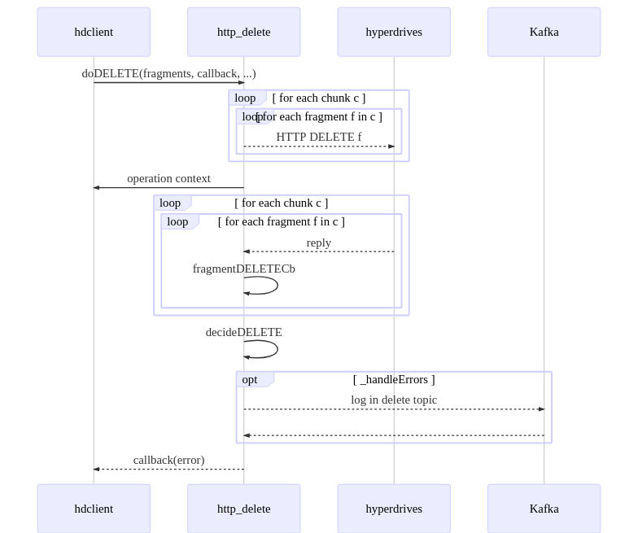
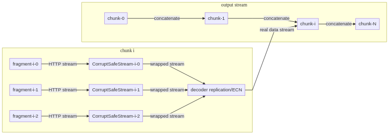
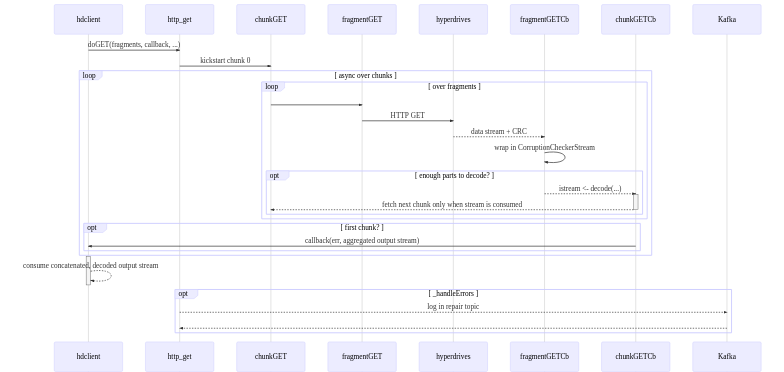

======================
Implementation details
======================

Code is located under ../lib/ folder. HdClient must be respect the `CloudServer data backend API`_,
and hence must work exclusively with nodejs streams.

Main entry point and helper files
---------------------------------

The definition of the data backend is in hdclient.js. This file simply defines the class and
dispatches each API method to a different handler, each handler being implemented in a separate
file: get -> http_get.js, put -> http_put.js, etc. This class is responsible of resources not
tied to a specific request: configuration, logging.

Most files are self explanatory and already in-depth explanation or where to find them:

* config.js: client configuration validation.
* corruption_stream_checker.js: BIZOP-related checksum to identify whether a retrieved stream is corrupted. Refer to the file for further detailed explanations.
* hdclient.js: main backend entry point.
* http_{get/put/delete}.js: API handlers for the main routes
* http_utils.js: shared HTTP related helpers and common, described below.
* keyscheme.js: implement key creation, validation, serialization and de-serialization. Format is specified there while requirements and rationale for the schema is described in Design_.
* placement.js: data placement, responsible for selecting which hyperdrives to store data on.
* protocol.js: implement HTTP protocol quirks required to communicate with hyperdrives. Specification can be found in hyperdrive's repository.
* split.js: split-related helpers, like determining best size to use and chunking the input stream.
* utils.js: where everything else goes

The following 3 graphs provide a high-level description of each operation (get/put/delete). Each is
then described in more details in its own section afterwards. Dashed arrow represents asynchronous
processing, while plain ones are for synchronous effects.

**PUT**
    .. image:: ../graphs/high_level_put.mermaid.png

**GET**
    .. image:: ../graphs/high_level_get.mermaid.png

**DELETE**
    .. image:: ../graphs/high_level_delete.mermaid.png

Main routes implementation
--------------------------

All three routes share a common structure and linguo. Let's first recap some vocabulary:

* object: the whole user object stream. On PUT what is given, on GET what should be forwarded to the user
* chunk: objects can be split if too large. A chunk is a contiguous part of the object stream. An objects is then a sequence of chunks.
* fragment: a chunk is used to generate several fragments (replicated or erasure coded).

Each operation sees an object as a 'matrix' of data D_i,j: each line is a chunk, each
entry of the line is a fragment. Each entry of D will eventually correspond to a network
call directed on a hyperdrive. As a result of split design, each column is assigned a
fixed hyperdrive: fragments j of all chunks is stored on hyperdrive j. This array is embodied
into an OperationContext (see http_utils.js), and it exposes:

* rawKey: serialized blob describing the object
* fragments: de-serialized rawKey
* nPending: counter of all operations to launch and wait on
* status: reply "matrix"-like fragment tracker
* log: logger

The different 3 routes (doGET, doPUT and doDELETE) then dispatch calls for all D_i,j in a timely
fashion - dependent of the operation. Again, all 3 routes fragment handling callback are similar,
and named fragment{GET|PUT|DELETE}. Internally, all dispatched fragment queries are assigned a
RequestContext with 3 fields:

* link to shared operation context
* chunkId: line in the data matrix D
* fragmentId: column in the data matrix D

Upon return of any fragment query, the shared operation context is updated with reply and/or
error, then fragment{GET|PUT|DELETE}Cb is invoked. Each fragment callback is responsible for
*rendez-vous* (waiting for enough answers to decide on the final outcome), then start decisio
procedure (decide{GET|PUT|DELETE}). The three sections below describe in more detail each route.
In order of complexity: DELETE, PUT and GET.

DELETE implementation details
~~~~~~~~~~~~~~~~~~~~~~~~~~~~~

The simplest route since we do not have to deal with input or output data stream. For people diving
in the client code for the first time, I recommend looking at this route first: it embodies all of
the main, common steps:

#. Dispatch: doDELETE & fragmentDELETE
#. Rendez-vous of responses: fragmentDELETECb
#. Final decision: decideDELETE -> aggregate repsonse from all fragments and "merge" the results
#. handling errors by logging in Kafka: _handleErrors, see Design_ for more details

PUT implementation details
~~~~~~~~~~~~~~~~~~~~~~~~~~

PUT implementation's structure closely follows the DELETE. The main difference is in doPUT. While doDELETE
was dispatching all requests in parallel, the PUT must first build a pipeline of streams to feed into each
fragmentPUT queries. The handling of responses, error and the rest is the same as in http_delete except
for the business logic - what is a failure:

#. Dispatch: doPUT => chunk input stream => [replicate/erasure code to get fragments => [send fragment]]
#. Rendez-vous of responses: fragmentPUTCb
#. Final decision: decidePUT -> aggregate repsonse from all fragments and "merge" the results
#. handling errors by logging in Kafka: _handleErrors, see Design_ for more details

**Stream graph to setup** Each link means piping data, with error and end propagation.
    .. image:: ../graphs/put_stream_dag.mermaid.png

**PUT detailed sequence**
    .. image:: ../graphs/put_details.mermaid.png

GET implementation details
~~~~~~~~~~~~~~~~~~~~~~~~~~

While GET follows closely PUT and DELETE architecture, we go up a notch on the complexity scale: all
fragment streams must be checked for corruption, in a way specified by BIZOP protocol. BIZOP announces
expected CRC in the headers, stream the data and add trailing real, computed CRC as a final binary blob.
For mor information, refer to lib/corruption_stream_checker.js or BIZOP specification. As for PUT, we only
retrieve all fragments of the current chunk, and only when we have decoded and forwarded it to the output
stream we request fragments of the next chunk.

The other main difference is we start streaming data back to caller as soon as possible ie without
waiting for all fragment queries to be answered. We wait for all to arrive in the background, then
decide perform the final checks: decideGET, _handleErrors (Kafka logging), etc.

Since we already started streaming data to the client, the only way to handle errors after the output
stream was handed over is to generate error events on it. This is also the approach taken by the stream
corruption check: forward all data but hold onto the last block until we have all the CRCs, compare and
eventually emit error events.

.. _`CloudServer data backend API` : https://github.com/scality/cloudserver/tree/development/8.1/docs/developers
.. _Design : ../Design.rst
